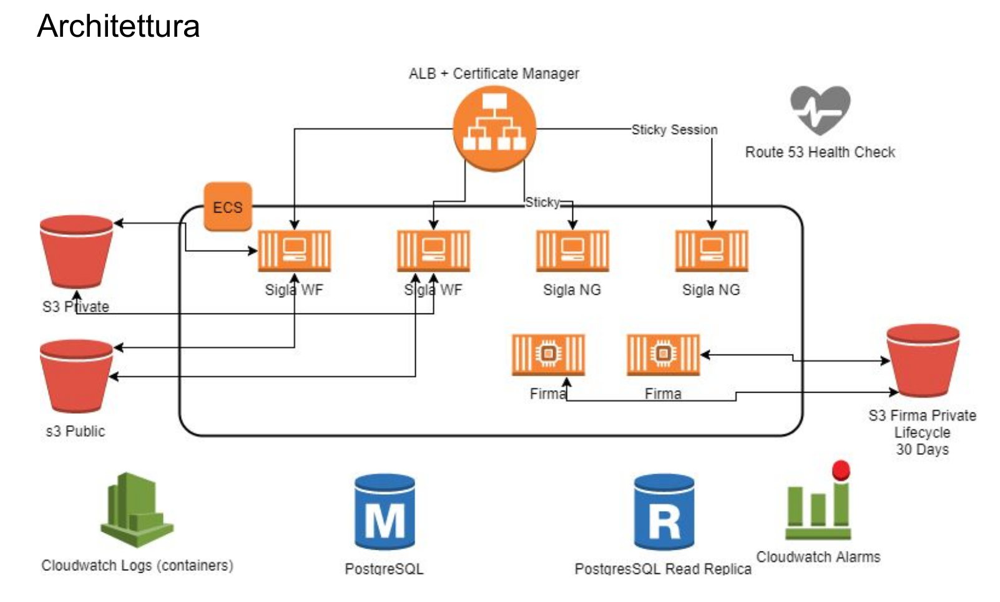
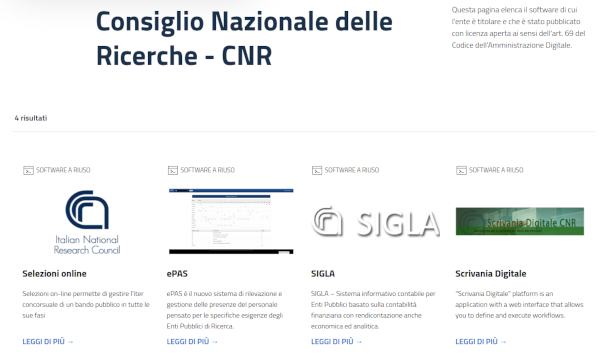
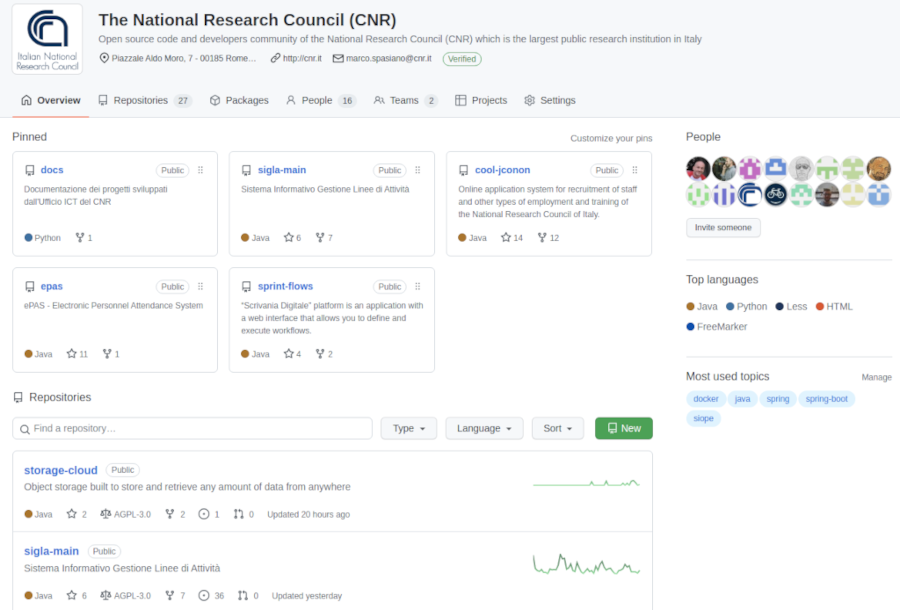

<!--s-->
## IL CNR
Il Consiglio Nazionale delle Ricerche per chi non lo conoscesse è il più grande ente di ricerca in Italia ed ha circa 8.000 dipendenti strutturati e circa 6.000 tra assegni, borse di studio e collaboratori, è formato da 90 istituti di ricerca di cui 4 prettamente informatici e da una struttura amministrativa centrale.<!-- .element: class="text-justify" --> 

Ha subito negli anni svariate riorganizzazioni sia a livello amministrativo contabile che organizzativo gestionale, per questo motivo agli inizi degli 2000 ha formato un gruppo interno per la gestione e lo sviluppo di quasi tutte le piattaforme software dell'ente.<!-- .element: class="text-justify" -->

<!--s-->
## OPEN SOURCE

Sin dal principio, anche per la vocazione di ente di ricerca, ha puntato su tecnologie open source, ed una corretta gestione del codice sorgente passando negli anni seguenti da Rational Clear Case a CVS a SVN ed infine a GIT.<!-- .element: class="text-justify" --> 

Il tutto ha facilitato enormemente il processo di sviluppo e messa in esercizio delle varie piattaforme che negli anni si sono susseguite.<!-- .element: class="text-justify" -->

<!--v-->

# SIGLA
## Un viaggio verso l'open source

* Rational Clear Case -> CVS -> SVN -> Git <!-- .element: class="fragment" data-fragment-index="0"-->
* Rational Clear Quest -> BugZilla -> GitLab/GitHub Issue <!-- .element: class="fragment" data-fragment-index="0"-->
* Crystal Report -> Jasper Report <!-- .element: class="fragment"  data-fragment-index="1"-->
* VisualAge for Java -> WSAD IBM -> Eclipse -> Intellij IDEA Community Edition <!-- .element: class="fragment" data-fragment-index="1"-->
* WebSphere 3.3 -> Jboss 4.2.3 -> Wildfly 10 -> Thorntail 2.7.0 <!-- .element: class="fragment" data-fragment-index="2"-->
* Oracle -> PostgreSQL <!-- .element: class="fragment" data-fragment-index="2"-->
<!--v-->
## POC - AWS

<!--s-->
## Developers Italia
#### 
* [SIGLA - Sistema Informativo Contabile.](https://developers.italia.it/it/software/cnr-consiglionazionaledellericerche-sigla-main)<!-- .element: class="fragment" data-fragment-index="0" --> 
* [ePAS - Sistema di rilevazione presenze.](https://developers.italia.it/it/software/cnr-consiglionazionaledellericerche-epas)<!-- .element: class="fragment" data-fragment-index="0" -->
* [Selezioni online - Sistema per il reclutamento del personale.](https://developers.italia.it/it/software/cnr-consiglionazionaledellericerche-cool-jconon)<!-- .element: class="fragment" data-fragment-index="1" --> 
* [Scrivania Digitale - Sistema per la gestione dei flussi amministrativi.](https://developers.italia.it/it/software/cnr-consiglionazionaledellericerche-sprint-flows)<!-- .element: class="fragment" data-fragment-index="1" -->

<!--s-->
## [github.com/consiglionazionaledellericerche](https://github.com/consiglionazionaledellericerche)

####  <!-- .element: height="100%" -->

<!--s-->
## COLLABORATION

#### 

Di certo qualcuno di voi si sta chiedendo, ma io sono un dipendente del piccolo comune di Preganziol (cit. Non a caso ma questa è un altra storia che forse racconteremo più avanti), che ha più  o meno gli stessi abitanti dei dipendenti del CNR, come posso fare?<!-- .element: class="text-justify" --> 

<!--v-->
## SI PUÒ FARE

<table width="100%" height="100%">
  <tr>
    <td width="50%"></td>  
    <td>
      Agli inizi degli anni 2000 non c'era quello che abbiamo oggi e non dobbiamo cominciare da zero, abbiamo il portale del riuso e i servizi cloud che ci permettono di valutare una piattaforma e poi di metterla in produzione con uno sforzo minimo, bastano le competenze e una partecipazione attiva alla community.<!-- .element: class="text-justify top" -->
      <h4>&nbsp;</h4>
    </td>
  </tr>
</table>

<!--s-->
# Community
## Le 5 If di Feynman

<table class="compact" width="100%" height="100%">
  <tr>
    <td width="40%"></td>  
    <td>
      <ol>
          <li>If you're wrong, admit it.</li><!-- .element: class="fragment text-justify" data-fragment-index="0" -->
          <li>If you're confused, ask questions.</li><!-- .element: class="fragment text-justify" data-fragment-index="0" -->
          <li>If you're stuck, seek for help.</li><!-- .element: class="fragment text-justify" data-fragment-index="1" -->
          <li>If you make mistake, learn from it.</li><!-- .element: class="fragment text-justify" data-fragment-index="1" -->
          <li>If you learn something, teach others.</li><!-- .element: class="fragment text-justify" data-fragment-index="2" -->
      </ol>
      <h4>&nbsp;</h4>
      <h4>&nbsp;</h4>
      <h4>&nbsp;</h4>
      <h4>&nbsp;</h4>
      <h4>&nbsp;</h4>
    </td>
  </tr>
  <tr><td><small>Richard Feynman</small></td><td></td></tr>
</table>
<!--s-->

# Grazie!
